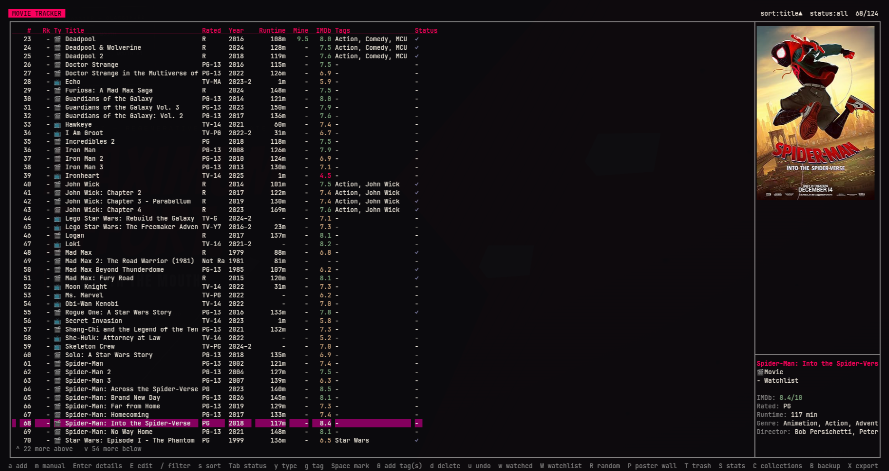
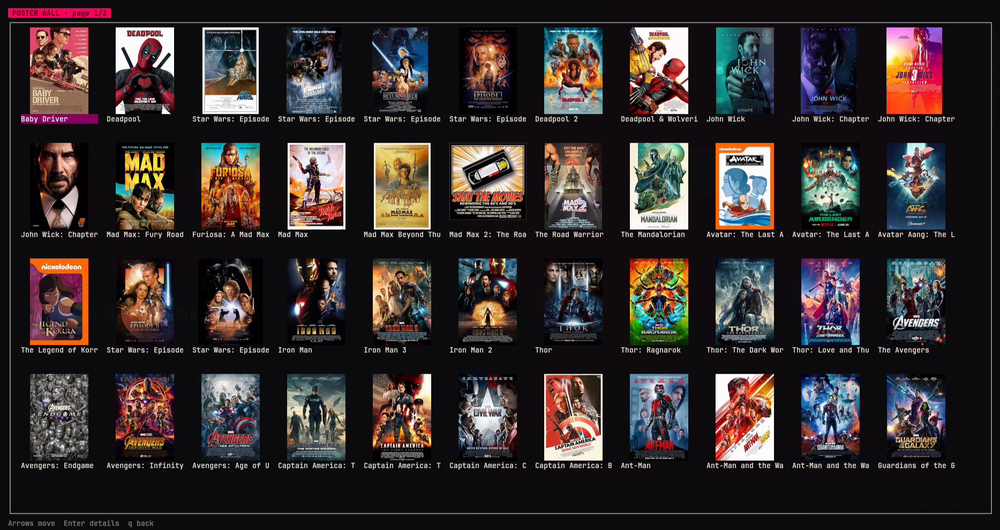

# Blockbuster


<details>
<summary>More screenshots (detail view, stats)</summary>





</details>

A keyboard-driven terminal app for tracking movies and TV series you've
watched: rating, personal rank, runtime (or episode runtime, season
count, and current season for series), content rating, poster, genre,
director, cast, watch status, watched date, rewatch count, notes, and
your own tags/collections.

No third-party dependencies — pure Python 3 standard library (`curses`,
`sqlite3`, `urllib`). On terminals at least 64 columns wide, a side
panel shows a live summary of the selected movie (rating, genre,
director, tags, and more) — plus a live poster in kitty, above the
summary. Narrower windows drop the poster and shrink less essential
columns; press `p` for a fullscreen poster instead, falling back to
`chafa` or your default image viewer outside kitty.

## Install

Requires only Python 3.10+ (for `curses` and `sqlite3`, both in the
standard library) — no `pip install` needed. Works on macOS and Linux;
`curses` isn't available on Windows.

```
git clone https://github.com/shadesdude66/Blockbuster.git
cd Blockbuster
python3 -m blockbuster
```

That's enough to run it — but `python3 -m blockbuster` only works from
inside the `Blockbuster` directory (that's how Python finds the
package); running it from elsewhere fails with
`No module named 'blockbuster'`. For a `blockbuster` command you can
run from anywhere:

```
mkdir -p ~/.local/bin
cat > ~/.local/bin/blockbuster <<EOF
#!/usr/bin/env python3
import sys
from pathlib import Path

sys.path.insert(0, "$(pwd)")

from blockbuster.ui import main

if __name__ == "__main__":
    main()
EOF
chmod +x ~/.local/bin/blockbuster
```

Run this from inside the `Blockbuster` directory — the unquoted
heredoc bakes in `$(pwd)` as the real clone path, so there's nothing to
edit by hand. Make sure `~/.local/bin` is on your `PATH`.

Optionally, add it to your app launcher with a `.desktop` file (Linux):

```
cat > ~/.local/share/applications/blockbuster.desktop <<'EOF'
[Desktop Entry]
Type=Application
Name=Blockbuster
Comment=Track movies you've watched: ratings, rank, runtime, posters
Exec=kitty --title blockbuster -e blockbuster
Terminal=false
Icon=video-x-generic
Categories=AudioVideo;Video;Database;
EOF
```

(Swap `kitty` for your own terminal if you don't have it — kitty just
gets you live poster images, per the note above.)

### Shell completion

Tab-completion for `blockbuster`'s `--help`/`--version` flags:

```
# bash - add to ~/.bashrc
source /path/to/Blockbuster/completions/blockbuster.bash

# zsh - put completions/_blockbuster on your $fpath (before compinit), e.g.
mkdir -p ~/.zsh/completions
cp completions/_blockbuster ~/.zsh/completions/
# then in ~/.zshrc, before compinit: fpath=(~/.zsh/completions $fpath)
```

## Run it

```
blockbuster
```

## Adding movies & TV series

- `a` — search OMDb by title (results cover movies and series, labeled
  `[Movie]`/`[Series]`). `Space` marks results, `Enter` adds all
  marked ones, or `Enter` with nothing marked adds just the one you're
  on. Each addition auto-fills year, runtime (or episode runtime and
  season count), genre, director, cast, plot, IMDb rating, and poster.
  "Load more results" fetches the next page past 10 matches, keeping
  your marks.
- `m` — add a movie or series manually (type, title, year,
  runtime/seasons, genre, director), no internet needed.

Online search needs a free OMDb API key: get one at
https://www.omdbapi.com/apikey.aspx (activate via email), then press
`K` in the app to save it. It's stored in
`~/.config/blockbuster/config.json`, or set the `OMDB_API_KEY`
environment variable instead. Press `K` again any time to update it or
add a second key for "where to watch" lookups (see below).

## Everyday keys

`Space` marks movies for bulk actions; `G`, `d`, `w`, and `W` below
apply to every marked movie, or just the selected one if none are
marked.

Status (`Tab`), type (`y`), tag (`g`), decade (`D`), and the free-text
filter (`/`, which matches title/genre/director/actors) all combine —
e.g. `Tab` to watchlist, `g` to a tag, and `D` to a decade narrows to
just that combination.

| Key | Action |
|---|---|
| `Up`/`Down`, `j`/`k` | move selection |
| `Enter` / `l` | open a movie's details |
| `E` | edit every field of the selected movie directly |
| `/` | filter by title, genre, director, or actors |
| `s` | cycle sort (rank, my rating, IMDb rating, title, watched date, runtime, date added, year) |
| `Tab` | cycle status filter (all / watchlist / watched) |
| `y` | cycle type filter (all / movie / series) |
| `g` | cycle tag filter (none, then each tag you've used) |
| `D` | cycle decade filter (none, then each decade you have titles from) |
| `Space` | mark/unmark selection |
| `Esc` | clear all marks |
| `G` | add tag(s) |
| `d` | delete (soft delete, see `u`) |
| `u` | undo: restore the most recently deleted movie(s) |
| `w` | mark as watched |
| `W` | mark as watchlist |
| `R` | random pick from your watchlist, with a slot-machine spin |
| `F` | recommended for you: watchlist titles most similar (by genre/director/cast) to your highly-rated watched movies; `Enter` opens a pick |
| `P` | poster wall: browsable kitty-image grid of cached posters; arrows move, `Enter` opens details |
| `T` | trash screen: browse, restore, or permanently delete |
| `S` | stats screen: totals, watch time, averages, top genres, decades |
| `C` | collections: your tags as franchises, with watched/total count, average rating, and a ★ once complete; `Enter` drills into a tag's titles by year |
| `B` | back up the database now (timestamped copy) |
| `X` | export the collection to CSV or JSON |
| `I` | import from a CSV/JSON file (same format as `X`'s export); skips anything already present, matched by IMDb id or title+year |
| `?` | full help screen |
| `q` | back / quit |

Ratings are color-coded (green ≥ 7.5, yellow ≥ 5, red below), using
your desktop theme's colors when available. A 🎬/📺 icon marks movies
vs. series, and a ✓ or `-` in Status shows watched vs. watchlist. Wide
terminals also show a Tags column.

Inside a movie's detail screen:

| Key | Action |
|---|---|
| `r` | set your rating (0–10) |
| `n` | set your rank |
| `M` | set/edit content rating (R, PG-13, TV-14, etc.) |
| `w` | toggle watched / watchlist |
| `t` | mark watched today |
| `c` | +1 rewatch count (also logs today's date) |
| `v` | view rewatch history (every logged date) |
| `o` | where to watch: streaming/rent/buy sources (needs a free Watchmode API key) |
| `N` | (series only) advance to the next season |
| `e` | edit notes |
| `E` | edit every field, grouped into sections (Title / Status & Ratings / Details / Text); changed fields marked `*`; `q` saves, `Esc` discards (confirms if changed) |
| `p` | view the poster fullscreen |
| `x` | delete this movie |

"Where to watch" (`o`) needs its own free API key from
https://api.watchmode.com/ (1,000 requests/month) — press `K` in the
list screen and enter it at the second prompt, or set the
`WATCHMODE_API_KEY` environment variable. Only works for titles added
via OMDb search (`a`), since it looks the title up by IMDb id.

## Data

- SQLite database: `~/.local/share/blockbuster/movies.db`
- Cached posters: `~/.local/share/blockbuster/posters/`
- Config (API keys): `~/.config/blockbuster/config.json`
- Manual backups (`B`): `~/.local/share/blockbuster/backups/`
- Exports (`X`): `~/.local/share/blockbuster/exports/`

Back up or sync `movies.db` to keep your data safe across machines, or
press `B` in the app for a timestamped copy. Deleting a movie (`d`/`x`)
just hides it — restore with `u` (or from the `T` trash screen), or
purge it permanently from trash by typing the exact title to confirm.

## Theming

On an Omarchy desktop, the app reads the active theme's accent/selection
colors from `~/.local/state/omarchy/current/theme/colors.toml` for the
header bar, selected row, and section headers. Switch themes and
relaunch to pick up the change. Elsewhere, or if that file is missing,
it falls back to plain default-color curses styling.

## Project layout

```
blockbuster/
  config.py     config + XDG data/cache paths
  db.py         SQLite schema and queries
  omdb.py       OMDb API client (search, details, poster download)
  watchmode.py  Watchmode API client (streaming/rent/buy availability)
  recommend.py  local genre/director/cast similarity scoring
  theme.py      reads the active Omarchy theme's colors, if present
  ui.py         curses TUI
  __main__.py   entry point (python3 -m blockbuster)
completions/    bash/zsh completion scripts for the blockbuster command
```
