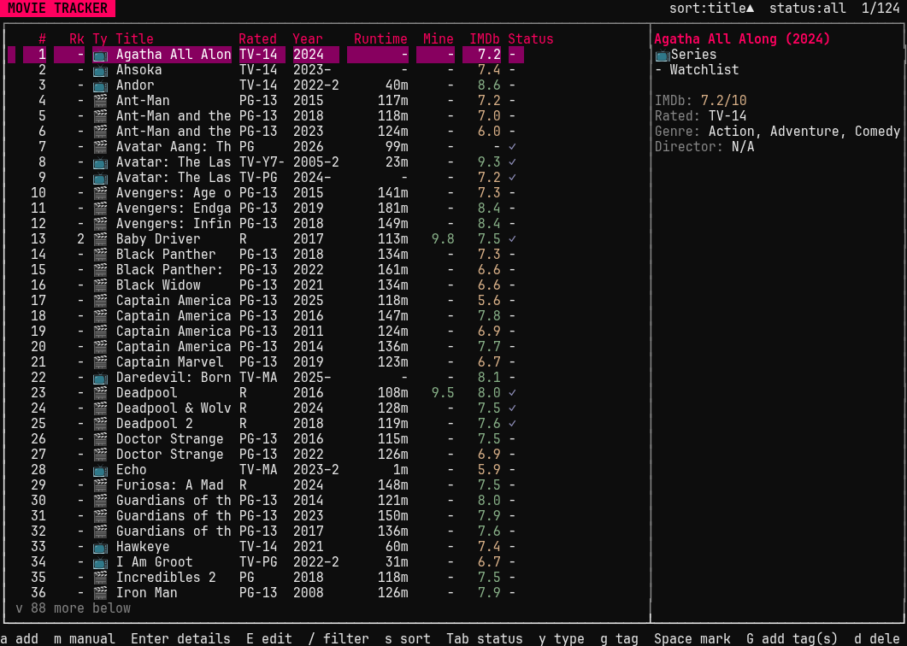
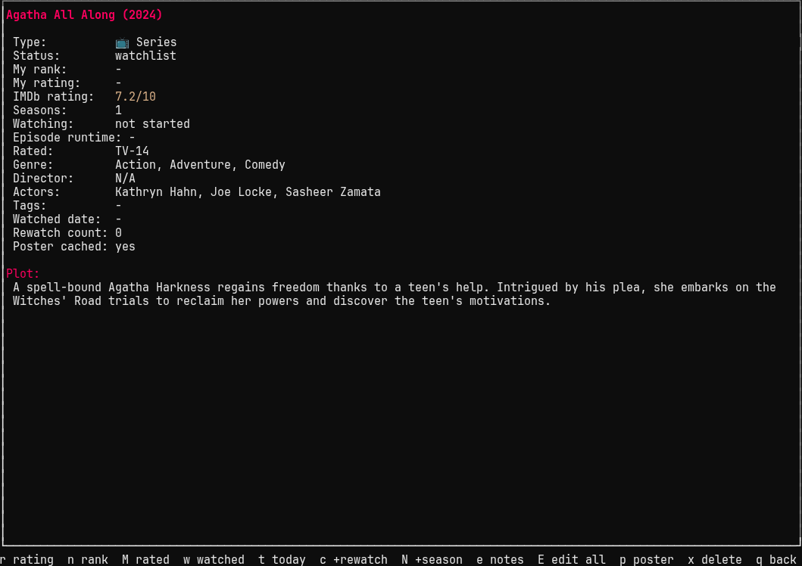
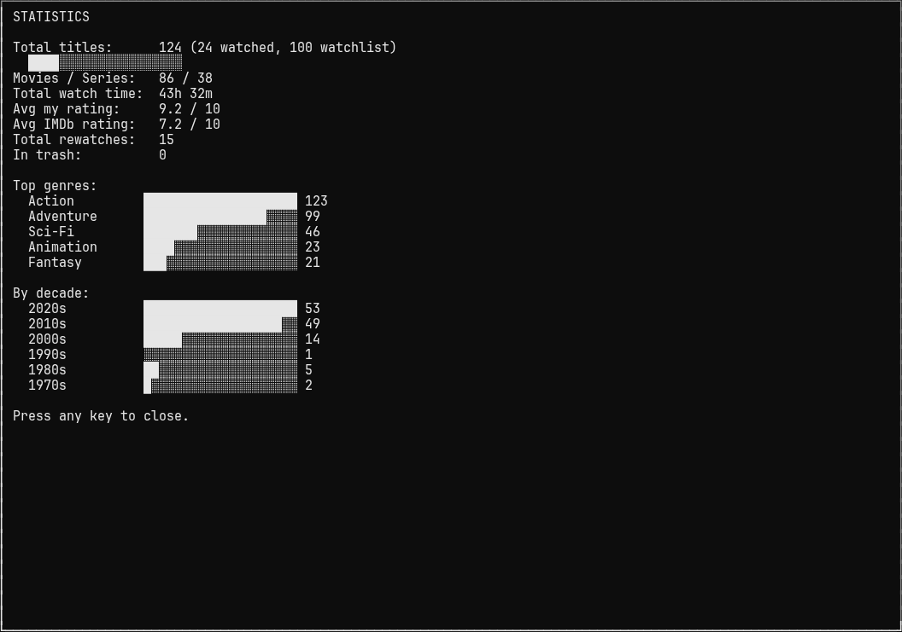

# Movie Tracker



<details>
<summary>More screenshots (detail view, stats)</summary>




</details>

A keyboard-driven terminal app for tracking movies and TV series you've
watched: your rating, your personal rank, runtime (or episode runtime and
season count, plus which season you're currently on, for series), content
rating (R, PG-13, TV-14, etc.), and a poster image, plus genre, director,
cast, watch status, watched date, rewatch count, notes, and your own
freeform tags/collections.

No third-party dependencies — pure Python 3 standard library (`curses`,
`sqlite3`, `urllib`). On a terminal at least 64 columns wide, a side
panel shows a live summary of whichever movie is selected (rating,
genre, director, tags, and more) as you scroll the list — and in kitty,
its poster too, live above the summary (the table's less essential
columns shrink or drop to make room on narrower windows). Below that
width, or for the poster outside kitty, `p` opens the poster fullscreen
instead — falling back to `chafa` if installed, or your default image
viewer, on terminals without kitty's image protocol.

## Run it

```
movie-tracker
```

(Installed at `~/.local/bin/movie-tracker`, already on your PATH. It also
shows up as "Movie Tracker" in your app launcher.)

## Adding movies & TV series

- `a` — search OMDb online by title (results include both movies and
  series, labeled `[Movie]`/`[Series]`). Press `Space` to mark as many
  results as you want and `Enter` to add them all at once, or just move
  to a single result and press `Enter` with nothing marked to add only
  that one. Each one added auto-fills year, runtime (episode runtime and
  season count for a series), genre, director, cast, plot, IMDb rating,
  and downloads the poster. If there are more than 10 matches, pick
  "Load more results" to fetch the next page (your marks are kept).
- `m` — add a movie or series manually (choose the type, then title,
  year, runtime/seasons, genre, director), no internet needed.

Online search needs a free OMDb API key: get one instantly at
https://www.omdbapi.com/apikey.aspx (check your email to activate it),
then press `K` in the app to save it. It's stored in
`~/.config/movie-tracker/config.json` (or set the `OMDB_API_KEY`
environment variable instead).

## Everyday keys

| Key | Action |
|---|---|
| `Up`/`Down`, `j`/`k` | move selection |
| `Enter` / `l` | open a movie's details |
| `E` | edit every field of the selected movie directly (same form as `E` in the detail screen) |
| `/` | filter the list by title, genre, director, or actors |
| `s` | cycle sort (rank, my rating, IMDb rating, title, watched date, runtime, date added, year) |
| `Tab` | cycle status filter (all / watchlist / watched) |
| `y` | cycle type filter (all / movie / series) |
| `g` | cycle tag filter (none, then each tag you've used) |
| `Space` | mark/unmark the selected movie for bulk actions (moves down after) |
| `Esc` | clear all marks |
| `G` | add tag(s) to every marked movie (or just the selected one if nothing's marked) |
| `d` | delete every marked movie, or just the selected one (soft delete, see `u`) |
| `u` | undo: restore the most recently deleted movie(s) |
| `w` | mark every marked movie, or just the selected one, as watched |
| `W` | mark every marked movie, or just the selected one, as watchlist |
| `R` | pick a random movie from your watchlist, with a little slot-machine spin before it lands |
| `P` | poster wall: a browsable kitty-image grid of every cached poster; arrows move, `Enter` opens details |
| `T` | trash screen: browse, restore, or permanently delete |
| `S` | stats screen: totals, watch time, averages, top genres, decades |
| `C` | collections screen: your tags as franchises, with a watched/total count, average rating, and a ★ COMPLETE badge once you've watched everything in it; `Enter` drills into a tag's titles sorted by year |
| `B` | back up the database now (timestamped copy) |
| `X` | export the collection to CSV or JSON |
| `I` | import from a CSV or JSON file (same format as `X`'s export); skips anything already in your collection, matched by IMDb id or by title+year |
| `?` | full help screen |
| `q` | back / quit |

My rating and IMDb rating are color-coded (green ≥ 7.5, yellow ≥ 5, red
below that) in both the list and detail screens, using your desktop
theme's colors when available (plain ANSI green/yellow/red otherwise). A
🎬/📺 icon marks movies vs. series, and a ✓ or `-` in the Status column
shows watched vs. watchlist at a glance. On a wide enough terminal, a
Tags column shows each movie's tags too.

Inside a movie's detail screen:

| Key | Action |
|---|---|
| `r` | set your rating (0–10) |
| `n` | set your rank |
| `M` | set/edit content rating (R, PG-13, TV-14, etc.) |
| `w` | toggle watched / watchlist |
| `t` | mark watched today |
| `c` | +1 rewatch count |
| `N` | (series only) advance to the next season, to track where you're up to |
| `e` | edit notes |
| `E` | edit every field at once, grouped into sections (Title / Status & Ratings / Details / Text). Changed fields are marked `*`; `q` saves, `Esc` discards (with confirmation if anything's changed) |
| `p` | view the poster fullscreen |
| `x` | delete this movie |

## Data

- SQLite database: `~/.local/share/movie-tracker/movies.db`
- Cached poster images: `~/.local/share/movie-tracker/posters/`
- Config (API key): `~/.config/movie-tracker/config.json`
- Manual backups (`B`): `~/.local/share/movie-tracker/backups/`
- Exports (`X`): `~/.local/share/movie-tracker/exports/`

Back up or sync `~/.local/share/movie-tracker/movies.db` if you want to
keep your data safe across machines — or just press `B` in the app for a
timestamped copy. Deleting a movie (`d`/`x`) doesn't remove its row —
it's hidden until you either restore it (`u`, or from the `T` trash
screen) or permanently purge it from the trash screen, which requires
typing the movie's exact title to confirm since that step can't be
undone.

## Theming

On an Omarchy desktop, the app reads the active theme's accent/selection
colors from `~/.local/state/omarchy/current/theme/colors.toml` and uses
them for the header bar, selected row, and section headers, instead of
plain reverse-video. Switch your system theme and relaunch the app to
pick up the change. On any other system, or if that file isn't present,
it falls back to plain default-color curses styling.

## Project layout

```
movie_tracker/
  config.py   config + XDG data/cache paths
  db.py       SQLite schema and queries
  omdb.py     OMDb API client (search, details, poster download)
  theme.py    reads the active Omarchy theme's colors, if present
  ui.py       curses TUI
  __main__.py entry point (python3 -m movie_tracker)
```
